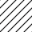

# Hello, World

this is a test file

Link to [Duck Duck Go](https://duckduckgo.com)

## Scary strings
"test.png", src='test.png', 

## external sources

## Emojis
😀 😃 😄 😁 😆 😅 😂 🤣 🥲 🥹 ☺️ 😊 😇 🙂 🙃 😉 😌 😍 🥰 😘 😗 😙 😚 😋 😛 😝 😜 🤪 🤨 🧐 🤓 😎 🥸 🤩 🥳 😏 😒 😞 😔 😟 😕 🙁 ☹️ 😣 😖 😫 😩 🥺 😢 😭 😮‍💨 😤 😠 😡 🤬 🤯 😳 🥵 🥶 😱 😨 😰 😥 😓 🫣 🤗 🫡 🤔 🫢 🤭 🤫 🤥 😶 😶‍🌫️ 😐 😑 😬 